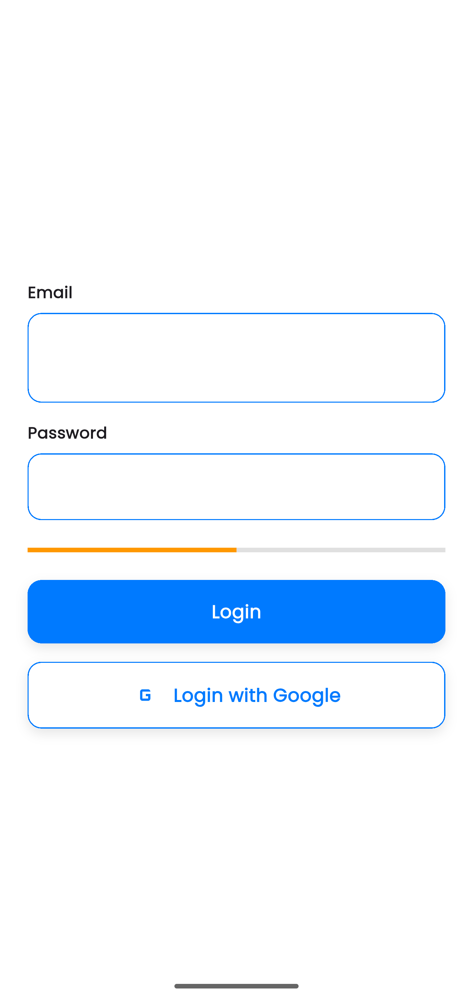
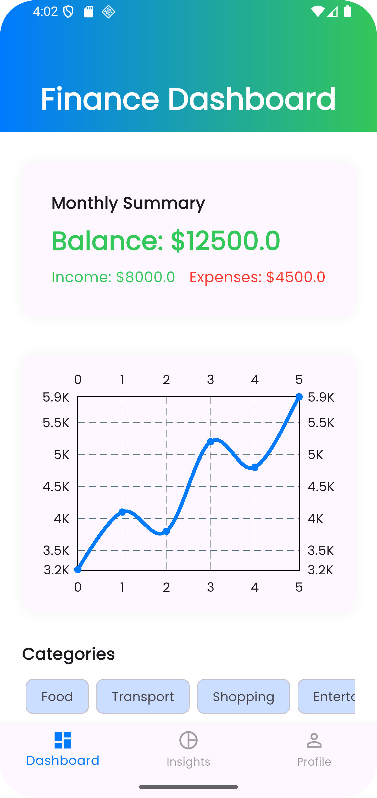
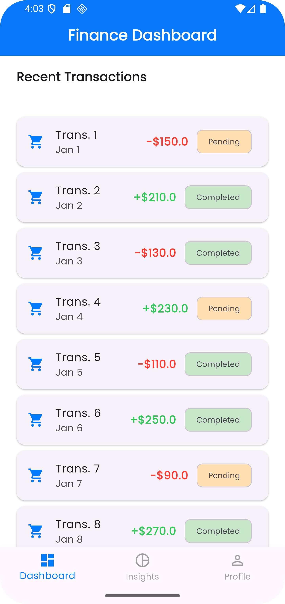
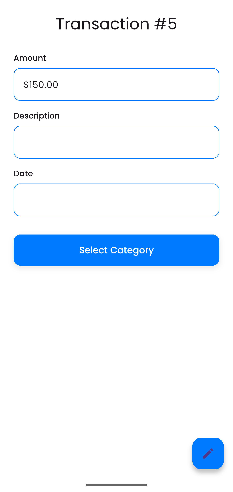
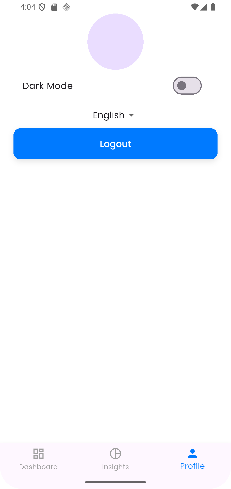

# AI-Driven Finance Dashboard Mobile App

A pixel-perfect Flutter application demonstrating advanced UI, clean architecture, and production-level UX.

## Features Implemented
- Authentication flow (Splash + Login with validation)
- Dashboard with custom app bar, line chart, transaction list
- Transaction detail with Hero animation and bottom sheet
- Insights with tabs and pie chart
- Profile with theme toggle, image picker, logout

## Architecture
- **Feature-first** folder structure
- Layers: Presentation, Domain, Data
- No business logic in widgets

## State Management
**Riverpod** – Chosen for efficient dependency injection, auto-dispose (prevents unnecessary rebuilds), and clean provider usage.

## Technical Highlights
- Custom widgets (no default Material styling)
- Dark mode support
- Consistent spacing system (8/16/24px)
- Micro-interactions and animations
- Optimized ListViews, const constructors
- Pull-to-refresh and skeleton loaders (bonus)

## Screenshots








## How to Run
```bash
flutter pub get
flutter run